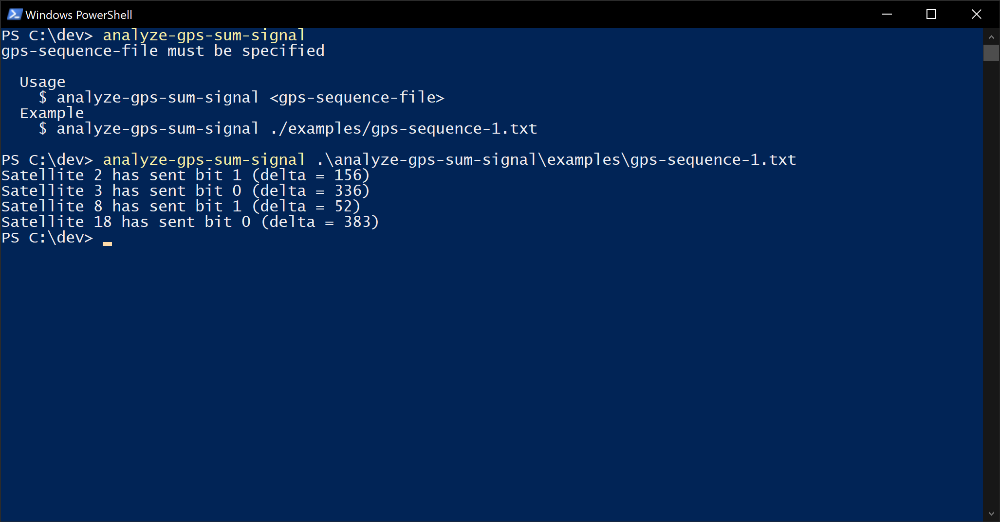
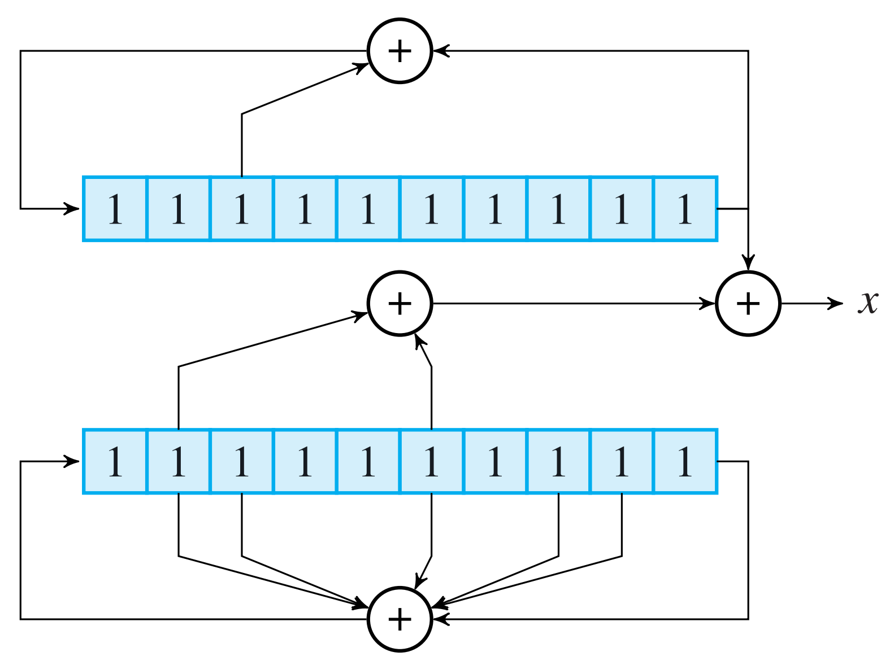

# analyze-gps-sum-signal
CLI app for analyzing a sum signal generated by GPS satellites (educational project)



## Getting Started

These instructions will get you a copy of the project up and running on your local machine for development and testing purposes. See deployment for notes on how to deploy the project on a live system.

### Prerequisites

#### Software

* [Node.js](https://nodejs.org) - JavaScript run-time environment

#### VS Code Extensions

This project is intended to be used with Visual Studio Code and the following extensions are recommended:

* [ESLint](https://marketplace.visualstudio.com/items?itemName=dbaeumer.vscode-eslint) - Integrates ESLint JavaScript into VS Code

## Deployment

### Prerequisites

* [Node.js](https://nodejs.org) - JavaScript run-time environment

### Installation and Execution

This package is not available on the npm registry, because it was developed as an educational project and is not suited for general use due to its limitations. So you will need to clone this repository and then use the following commands to set the project up and run it:

```bash
# in general you need run these commands
# in the root directory of the repository

# 1. install dependencies
npm i

## variant A
# 2. run via npm script
npm start --silent <args>

## variant B
# 2. make executable available globally
npm link

# 3. run via global executable
# can be called from any directory
analyze-gps-sum-signal <args>
```

## Limitations

### GPS Sequence

#### Format

* list of numbers separated by spaces

#### Content

* exactly `1023` signal sums
* each satellite has a chip sequence length of `1023`
* satellite signals "wrap around"
  * this ensures that the signal sums always contain a satellite's complete signal sequence, even if it doesn't start at index `0` of the signal sums
  * e.g. if a satellite's signal sequence starts at index `42` of the signal sums, instead of just cutting off the last `42` chips (due to the length limitation), those chips are just place at the beginning of the signal sums
* each satellite's signal sequence is encoded using a chip sequence generated by a Gold code generator with the following configuration
  * mother sequence 1 uses the bits on the indexes `2, 9` (zero-based) when rotating
  * mother sequence 2 uses the bits on the indexes `1, 2, 5, 7, 8, 9` (zero-based) when rotating
  * for each satellite a different register sum is used according to the following table:

|satellite id|register sum (zero based index)
|-|-
|1|1⊕5
|2|2⊕6
|3|3⊕7
|4|4⊕8
|5|0⊕8
|6|1⊕9
|7|0⊕7
|8|1⊕8
|9|2⊕9
|10|1⊕2
|11|2⊕3
|12|4⊕5
|13|5⊕6
|14|6⊕7
|15|7⊕8
|16|8⊕9
|17|0⊕3
|18|1⊕4
|19|2⊕5
|20|3⊕6
|21|4⊕7
|22|5⊕8
|23|0⊕2
|24|3⊕5

This means the Gold code generator for satellite 1 looks like this:



### [Fitting Examples of GPS Sequences](examples)

## Built With

* [meow](https://github.com/sindresorhus/meow) - CLI app helper

## Authors

* **Robin Hartmann** - *Project realization* - [robin-hartmann](https://github.com/robin-hartmann)
* **Dirk Hoffmann** - *Project idea, configurations, examples and Gold code generator graphic* - [dirkwhoffmann](https://github.com/dirkwhoffmann)

## License

This project is licensed under the MIT License - see the [LICENSE](LICENSE) file for details
